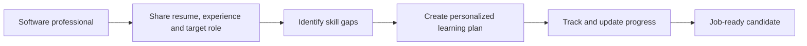

# Career Switch Assistant

Career Switch Assistant is a guided career-readiness platform for software professionals with 1–5 years of experience who want to move into a specific technical role or prepare for their next opportunity.

It turns an often confusing career transition into a focused, practical plan: identify the gap between a person's current experience and their target role, prioritize the skills that matter most, and help them build proof that they are ready to be hired.

## The problem

Early-career and mid-junior software professionals frequently know they want to grow, but not what to do next. They may be aiming for a new specialization—such as frontend, backend, full-stack, cloud, data, DevOps, QA automation, or cybersecurity—or simply a stronger role at another company.

Generic roadmaps and scattered online courses rarely answer the questions that matter for an individual transition:

- Which skills are missing for my target role?
- What should I learn first, and what can I safely defer?
- Which projects best demonstrate that I can do the job?
- How do I turn my current experience into a credible resume, portfolio, and interview story?
- How can I measure whether I am actually job-ready?
- How to keep consistancy by dividing large goald into task that I can track? 

Without a structured answer, people spend time on low-impact learning, lose momentum, consistancy and apply before they can confidently show the capabilities employers expect.

## Our product

Career Switch Assistant provides a personalized path from current role to target role. Users provide their resume in pdf format and describe their experience, skills, goals, and time availability; the product then helps them create and follow a role-specific transition plan.

The platform is designed to support the complete journey:

- **Role targeting:** clarify the destination role and the expectations associated with it.
- **Skill-gap analysis:** compare existing strengths with the practical technical, tooling, and communication skills needed next.
- **Adaptive learning roadmap:** organize high-value learning into achievable milestones instead of an overwhelming checklist.
- **Daily task tracker:** provide a list of task to achieve a goal and will provide an option to connect with discord, so user will get notification which task to take up, also there is a dedicated dashboard to track the tasks

Rather than treating a career change as a collection of courses, Career Switch Assistant treats it as an outcome-driven plan: become demonstrably ready for a particular technical role.

## Who it is for

The product is built for software professionals with roughly 1–5 years of experience who:

- want to specialize or switch technical tracks;
- are preparing for a more demanding engineering role;
- have learned independently but need structure and prioritization; or
- want a clear, evidence-based definition of job readiness.
- want to get personalised remainter on tasks and track the daily progress

## Product vision

Our goal is to make technical career advancement more deliberate and accessible. Every user should be able to see where they are today, understand what their chosen role requires, and follow a practical route to becoming a competitive candidate.

## Product block diagram

This simple diagram shows the initial product flow.

## Technology stack

The following is the proposed technology baseline for the application. Update it as implementation decisions are finalized.

- **Monorepo:** npm workspaces
- **Web application:** Next.js, React, TypeScript
- **Design system:** Astryx, Tailwind css
- **API:** Node.js, TypeScript, Express
- **Discord bot:** discord.js, TypeScript
- **Database:** PostgreSQL, MongoDB
- **AI:** gemini free trial
- **Testing:** Vitetest, React Testing Library, Playwright 
- **Shared packages:** UI components, TypeScript types, validation schemas, and configuration
