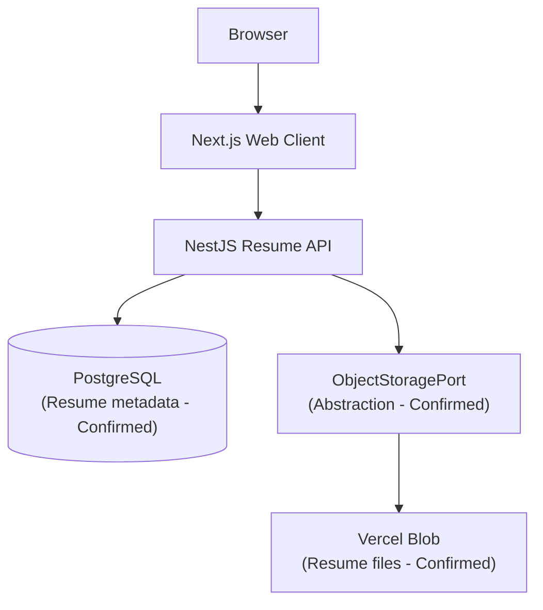

# ADR 002: Use Vercel Blob for Resume Object Storage

## Status

Accepted

## Context

Career Switch Assistant requires users to upload resume files (such as PDF and DOCX) to initiate career readiness assessment and profile extraction. In [ADR 001](001-technology-stack.md), resume storage was proposed as an object storage layer separate from PostgreSQL, with provider selection deferred.

## Decision

Use Vercel Blob as the object-storage layer for resume files in the initial version of Career Switch Assistant.

- **PostgreSQL** remains the authoritative system of record for resume metadata (e.g., file IDs, user associations, filenames, content types, processing status, timestamps).
- **Vercel Blob** stores the raw uploaded resume binary content (PDF/DOCX).
- The application accesses storage through an `ObjectStoragePort` abstraction in the application/domain layer, ensuring the Resume domain is not directly coupled to Vercel Blob vendor APIs.

## Rationale

- **Avoid unnecessary infrastructure overhead**: Avoids provisioning and managing AWS IAM, S3 buckets, and separate billing during MVP development.
- **Straightforward integration**: Integrates smoothly with the Next.js / Vercel deployment pipeline.
- **Covers upload requirements**: Provides reliable upload, download, and deletion capabilities for the required resume file types.
- **Separation of concerns**: Keeps PostgreSQL focused on structured relational application data while preventing database bloat from large binary objects.
- **Portability**: Implementing storage via an `ObjectStoragePort` abstraction isolates vendor-specific SDK code, preserving the option to migrate to AWS S3, Cloudflare R2, or another S3-compatible object storage provider in the future without changing core domain logic.

## Architecture

```text
Browser
   │
   ▼
Next.js
   │
   ▼
NestJS Resume API
   │
   ├── PostgreSQL
   │      └── Resume metadata
   │
   └── ObjectStoragePort
           │
           ▼
       Vercel Blob
           └── Resume files
```

### Component Flow



## Consequences

- **Positive**: Low operational overhead, zero AWS configuration needed for initial launch, clean domain separation through ports and adapters.
- **Negative / Considerations**: Vercel Blob is tied to the Vercel ecosystem for file hosting; file size limits and bandwidth costs must be monitored as active user volume grows.
- **Mitigation**: The `ObjectStoragePort` interface guarantees that adapter replacement with S3 or an alternative S3-compatible provider requires only implementing a new adapter class.
