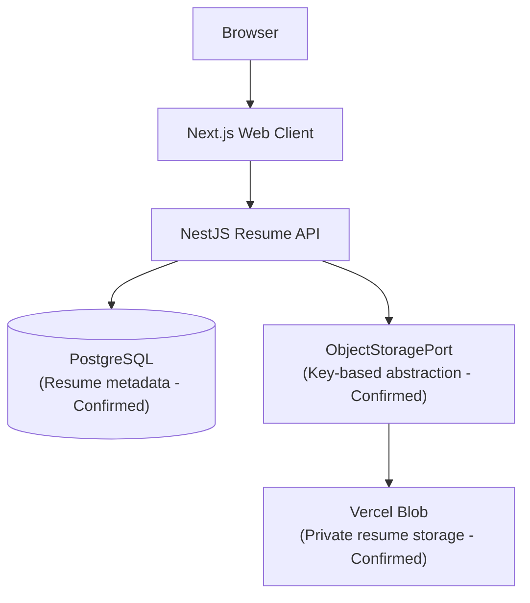

# ADR 002: Use Vercel Blob for Resume Object Storage

## Status

Accepted

## Context

Career Switch Assistant requires users to upload resume files (such as PDF and DOCX) to initiate career readiness assessment and profile extraction. In [ADR 001](001-technology-stack.md), resume storage was proposed as an object storage layer separate from PostgreSQL, with provider selection deferred.

## Decision

Use Vercel Blob as the object-storage layer for resume files in the initial version of Career Switch Assistant with strict access controls:

- **PostgreSQL** remains the authoritative system of record for resume metadata (e.g., file IDs, user associations, filenames, content types, processing status, timestamps).
- **Vercel Blob** stores the raw uploaded resume binary content (PDF/DOCX).
- **Private Access**: All resume objects are stored with `access: 'private'`. Resumes contain personally identifiable information (PII) and are never publicly readable. Download access is granted only after database ownership authorization.
- **Immutable Server Storage Keys**: The server generates canonical, immutable storage keys adhering to ownership boundaries (`users/{userId}/resumes/{resumeId}/original`). Client-supplied URLs are never trusted as authoritative references.
- **Key-Based Abstraction**: The application accesses storage through an `ObjectStoragePort` abstraction that operates on application-controlled storage keys rather than arbitrary URLs.

## Rationale

- **Avoid unnecessary infrastructure overhead**: Avoids provisioning and managing AWS IAM, S3 buckets, and separate billing during MVP development.
- **Straightforward integration**: Integrates smoothly with the Next.js / Vercel deployment pipeline.
- **Security & Privacy**: Enforces `private` access natively so resumes cannot be accessed by unauthenticated parties guessing URLs.
- **Separation of concerns**: Keeps PostgreSQL focused on structured relational application data while preventing database bloat from large binary objects.
- **Portability**: Implementing storage via an `ObjectStoragePort` abstraction isolates vendor-specific SDK code, preserving the option to migrate to AWS S3, Cloudflare R2, or another S3-compatible object storage provider in the future without changing core domain logic.

## Architecture

```text
Browser
   │
   ▼
Next.js
   │
   ▼
NestJS Resume API
   │
   ├── PostgreSQL
   │      └── Resume metadata (Authority)
   │
   └── ObjectStoragePort (Key-based)
           │
           ▼
       Vercel Blob (Private Storage)
           └── users/{userId}/resumes/{resumeId}/original
```

### Component Flow



## Consequences

- **Positive**: Zero public file exposure, low operational overhead, clean domain separation through ports and adapters, resilient to client URL tampering.
- **Negative / Considerations**: Vercel Blob private access requires server-mediated verification and signed/presigned download tokens; bandwidth and storage quotas must be monitored.
- **Mitigation**: The `ObjectStoragePort` interface guarantees that adapter replacement with S3 or an alternative S3-compatible provider requires only implementing a new adapter class.
