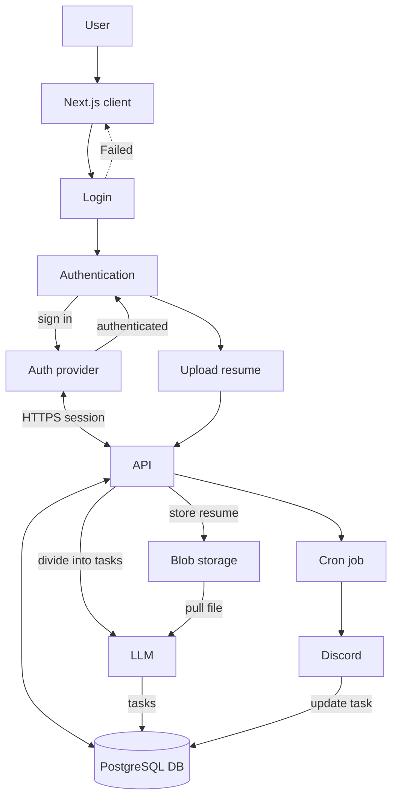

# System Design

This document describes the initial architecture for Career Switch Assistant. It is a proposed design based on the technology decisions in [ADR 001](../adr/001-technology-stack.md); details may change as requirements are validated.

## 1. System context

Career Switch Assistant helps software professionals assess their readiness for a target role, follow a personalized roadmap and prepare for applications.

External actors and services:

- **User:** accesses the web application and may interact through Discord.
- **AI provider:** Gemini initially, used for tailored recommendations and document analysis.
- **Authentication provider:** verifies identity and manages user sessions.
- **Notification provider:** sends progress notifications via discord, if enabled.

## 2. Container / application architecture

The system is organized as an npm-workspaces monorepo.

| Container | Responsibility | Primary technology |
| --- | --- | --- |
| `apps/web` | User interface for onboarding, roadmaps, progress, resumes, and settings | Next.js, React, TypeScript |
| `apps/api` | HTTP API, business rules, authorization, AI orchestration, and persistence | Express, Node.js, TypeScript |
| `apps/discord-bot` | Optional conversational interface and progress reminders | discord.js, TypeScript |
| PostgreSQL | Durable relational data: users, goals, roadmaps, tasks, resumes, and audit data | PostgreSQL |
| Redis | Cache, rate limiting, queues, and background-job coordination | Redis |
| AI provider | Generates role guidance and analyzes resumes | Gemini initially |
| Shared packages | Reusable UI, types, validation, and configuration | TypeScript packages |

The web application and Discord bot call the API. The API is the only application component that directly accesses PostgreSQL, Redis, and the AI provider.

## 3. Backend architecture

The API should be structured by feature rather than by technical layer alone:

- **Routes/controllers:** authenticate requests, validate input, and return HTTP responses.
- **Services:** implement use cases such as roadmap creation, readiness scoring, and resume analysis.
- **Repositories:** isolate PostgreSQL queries and transactions.
- **AI orchestration:** prepares safe prompts, invokes the AI provider, validates structured output, and records usage.
- **Workers:** execute long-running work such as resume extraction and AI analysis from Redis-backed jobs.
- **Cross-cutting concerns:** authorization, input validation, rate limits, error handling, logging, and audit events.

Feature modules should initially include authentication, profiles, target roles, skill assessments, roadmaps, progress, resumes, AI guidance, and notifications.

## 4. Data flow

1. A user completes onboarding with their current experience, skills, desired role, and availability.
2. The web app validates the form and submits it to the API over HTTPS.
3. The API verifies the session, validates the request, and stores the profile and goal in PostgreSQL.
4. The API calculates deterministic inputs, such as known skills and available time, then requests AI-assisted recommendations when needed.
5. The resulting roadmap, milestones, and tasks are stored in PostgreSQL and returned to the client.
6. As users complete tasks or projects, the API records progress and recomputes readiness indicators.
7. Redis caches frequently read data and coordinates background tasks; PostgreSQL remains the source of truth.

## 5. AI flow

1. The user requests an action such as roadmap generation, resume feedback, or interview-question practice.
2. The API checks authorization, quota, rate limits, and input size.
3. The AI orchestration layer combines the request with role requirements and relevant user context, minimizing personally identifiable information.
4. The API sends a versioned prompt to Gemini and requests structured output.
5. The response is validated against a schema. Invalid, unsafe, or incomplete output is retried, safely rejected, or converted into a fallback response.
6. Valid results are saved with prompt/version metadata and returned to the user.

AI output is advisory. The product should state that it does not guarantee employment outcomes and should avoid presenting recommendations as factual hiring decisions.

## 6. Authentication flow

1. A user signs up or signs in through the selected authentication provider.
2. The provider verifies credentials or OAuth consent and issues a secure session or token.
3. The web app sends the session/token over HTTPS with API requests.
4. The API verifies its signature, expiry, issuer, and audience before loading the user identity.
5. Authorization checks ensure users can access only their own profiles, resumes, roadmaps, and progress records.
6. Logout or revocation invalidates the session according to the provider's supported mechanism.

Secrets and raw credentials must never be stored in application logs. Session cookies should be `HttpOnly`, `Secure`, and `SameSite` where cookie-based authentication is used.

## 7. Resume processing flow

1. The user uploads a resume through the web app.
2. The API validates ownership, file type, size, and malware-scan status before accepting it.
3. The original file is stored in private object storage; PostgreSQL stores metadata and processing status.
4. A background job extracts text and sends only the necessary content to the AI provider for analysis.
5. The service validates and stores structured feedback, such as missing role keywords, strengths, and suggested improvements.
6. The user reviews the feedback in the web app. They can replace or delete the resume and its derived data.

Resumes are highly sensitive personal data. Apply encryption in transit and at rest, short retention defaults, access controls, and deletion support.

## 8. Deployment architecture

- **Web app:** deploy Next.js as a managed web service or container behind HTTPS and a CDN.
- **API:** deploy Express as horizontally scalable containers behind a load balancer.
- **Discord bot:** deploy as a separate long-running worker/service.
- **Worker processes:** deploy separately from the API so long-running AI and document jobs do not block requests.
- **PostgreSQL and Redis:** use managed services with private network access, backups, monitoring, and encryption.
- **Object storage:** use private, encrypted storage for uploaded resumes.
- **Configuration and secrets:** inject through a managed secrets service; never commit them to source control.
- **Observability:** centralize structured logs, metrics, traces, error reporting, and alerts.

Separate development, staging, and production environments. CI should run linting, tests, and security checks before deployment; production releases should support rollback.

## 9. Major risks

| Risk | Impact | Initial mitigation |
| --- | --- | --- |
| Inaccurate or generic AI guidance | Reduced user trust and poor career decisions | Use structured prompts, validation, evaluation datasets, feedback controls, and clear advisory language |
| Exposure of resume or profile data | Privacy and compliance harm | Minimize data, encrypt it, restrict access, scan uploads, and provide deletion controls |
| AI cost or provider rate limits | Unpredictable costs and slow features | Set quotas, cache safe results, queue jobs, monitor spend, and abstract the provider |
| Resume-processing failures | Broken core user journey | Use asynchronous jobs, status visibility, retries, and a manual retry path |
| Weak readiness scoring | Misleading job-readiness claims | Make scoring explainable, show evidence and gaps, and validate it with users and recruiters |
| Monorepo dependency drift | Build and deployment instability | Enforce shared linting, type checks, dependency policies, and CI validation |

## 10. Open questions

- Which authentication provider and sign-in methods will be used?
- Will the product support only one region at launch, and what data residency requirements apply?
- Which object-storage provider will hold resumes, and how long should originals and extracted text be retained?
- What exact role taxonomy and skill framework will power skill-gap analysis?
- How will readiness be scored, explained, and validated?
- What AI model, quota limits, fallback behavior, and cost budget are required for launch?
- Is Discord required for the first release, or should it follow the web experience?
- Which deployment platform and CI/CD provider should be selected?
- What accessibility, privacy, and legal requirements apply to the first release?

## 11. Architectural block diagram

The API coordinates authenticated requests, persistence, resume storage, and AI-assisted task generation. Scheduled jobs send progress activity to Discord.
