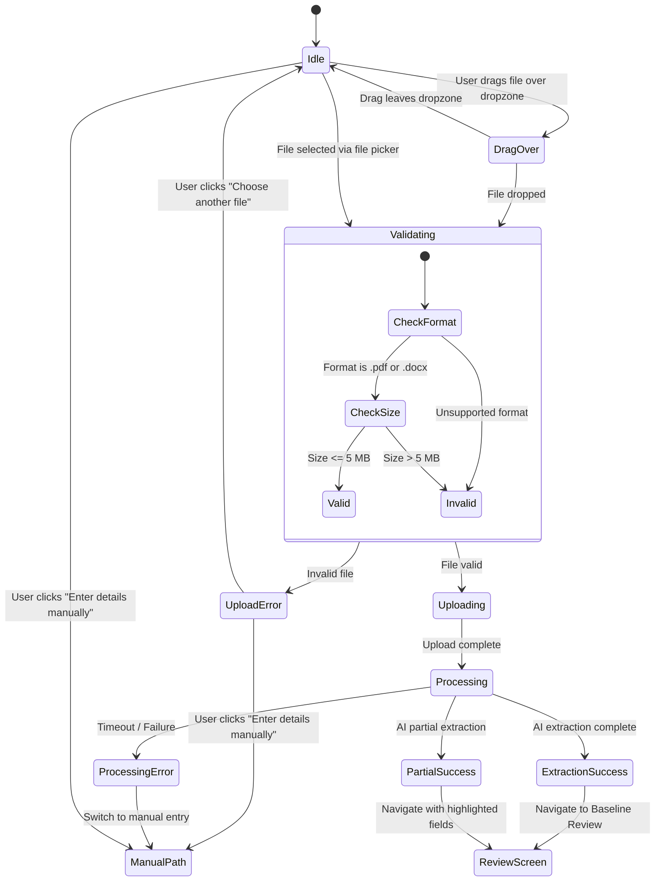

# Career Profile Visual & Interaction Design

## UI Engineering Flow

```text
Product UX
    ↓
Design System Decision
    ↓
Asterix Meta Design System
    ↓
Visual Design
    ↓
Component mapping
    ↓
Next.js implementation
```

---

## 1. Design Goal

Create a clean, modern, and trustworthy onboarding experience for software professionals transitioning to a target technical role.

The interface must feel like an intelligent, empowering career partner—not an administrative HR form or a generic job board.

---

## 2. Design System

### Asterix Meta Design System

Career Switch Assistant will use the [Asterix Meta Design System](https://astryx.atmeta.com/) as the primary design system for the product UI.

The design system will be used for:

- Typography
- Color tokens
- Spacing
- Buttons
- Form controls
- Cards
- Notifications
- Dialogs
- Progress indicators
- Accessibility patterns
- Responsive behavior

We prefer existing Asterix components and design tokens over creating custom components. Custom components should only be introduced when the product requires behavior or presentation that is not adequately supported by the design system.

### Consumption Architecture

Large engineering organizations do not redesign foundational UI primitives for every product; they establish or adopt a design system and build product experiences on top of it.

Rather than independently defining custom scales and primitives, Career Switch Assistant directly consumes the Asterix design foundation:

```text
Asterix Design System
        │
        ├── Tokens (Color, Typography, Spacing, Elevation)
        ├── Components (Primitives, Layout, Form controls)
        ├── Accessibility (Focus management, ARIA patterns)
        └── Patterns (Feedback, Transitions, States)
                ↓
       Career Switch Assistant
                ↓
       Product-specific UX (Resume Dropzone, Goal Selector, Review Flow)
```

### Design System Principles

1. **Prefer existing Asterix components:** Default to Asterix primitives before proposing custom UI elements.
2. **Reuse design tokens instead of introducing arbitrary values:** Consume Asterix typography, spacing, surface, and color tokens rather than writing hardcoded or custom CSS values.
3. **Follow Asterix accessibility conventions:** Rely on Asterix built-in keyboard navigation, focus rings, contrast ratios, and ARIA roles.
4. **Extend components only when necessary:** Compose or wrap existing Asterix components when domain behavior requires it, without altering design tokens.
5. **Avoid creating duplicate components that already exist in Asterix:** Do not build custom buttons, inputs, modals, or badges when Asterix already provides them.
6. **Keep product-specific components separate from design-system primitives:** Maintain clear separation between foundational Asterix design system primitives and Career Switch Assistant product domain logic.

---

## 3. Product Component Mapping

### Verification Workflow

Before writing implementation code, the exact package export, component names, prop types, and token access methods must be verified directly against the Asterix library:

```text
Asterix
   ↓
Available components
   ↓
Actual package/API
   ↓
Actual token mechanism
   ↓
Theme mechanism
   ↓
Next.js integration
```

We do not assume prop names (e.g., assuming `variant="primary"`) or exact component exports without verification. The table below represents our architectural mapping intent from product requirements to candidate Asterix primitives, with all entries to be verified during the Asterix integration spike.

### Component Mapping Table

| Product Requirement          | Asterix Component / Primitive                   | Status                                                    | Composition & Usage Intent                                                                                                                                      |
| :--------------------------- | :---------------------------------------------- | :-------------------------------------------------------- | :-------------------------------------------------------------------------------------------------------------------------------------------------------------- |
| **Primary CTA**              | Asterix `Button`                                | To be verified during Asterix integration spike           | Primary actions (e.g., "Review profile", "Confirm target role").                                                                                                |
| **Secondary CTA**            | Asterix `Button`                                | To be verified during Asterix integration spike           | Secondary actions / escape hatches (e.g., "[ Enter details manually ]", "Change file").                                                                         |
| **Resume Upload / Dropzone** | Asterix `Card` + `Stack` + `Button` (Composite) | Composite to be verified during Asterix integration spike | Asterix may not provide a specialized resume dropzone; composed candidate using Asterix container/layout primitives, text, and button with HTML5 drag-and-drop. |
| **Text Fields**              | Asterix `Field` + `Input` / `FieldLabel`        | To be verified during Asterix integration spike           | Form fields for Current Role, Years of Experience, and manual corrections.                                                                                      |
| **Target Role Selector**     | Asterix `Select` / `Combobox`                   | To be verified during Asterix integration spike           | Searchable target role selection with standard keyboard interaction.                                                                                            |
| **Skills Display & Input**   | Asterix `Badge` / `Tag` / `Chip`                | To be verified during Asterix integration spike           | Interactive, removable badges representing extracted and manual technical skills.                                                                               |
| **Errors & Validation**      | Asterix `Alert` / `Field` validation message    | To be verified during Asterix integration spike           | Client-side file rejection (format, size) and inline form validation.                                                                                           |
| **Processing & Loading**     | Asterix `ProgressBar` / `Spinner`               | To be verified during Asterix integration spike           | Indeterminate progress indicator during AI extraction and roadmap generation.                                                                                   |
| **Success Feedback**         | Asterix `Toast` / `Notification`                | To be verified during Asterix integration spike           | Transient feedback confirming profile save and baseline updates.                                                                                                |
| **Content Container**        | Asterix `Card` / `Layout` (`Stack`)             | To be verified during Asterix integration spike           | Constrained container for onboarding steps utilizing Asterix surface and layout tokens.                                                                         |
| **Step Indicator**           | Asterix `ProgressBar` / `Stepper`               | To be verified during Asterix integration spike           | Progress indicator representing multi-state onboarding (Step 1: Baseline → Step 2: Goal).                                                                       |

---

## 4. Consuming Asterix Tokens

Career Switch Assistant consumes Asterix tokens directly through CSS variables or Asterix styling packages:

- **Typography:** Rendered using Asterix typography primitives and tokens rather than custom font declarations.
- **Spacing:** Layout gaps, margins, and padding consume Asterix spacing tokens and layout primitives. Exact token values will be documented as facts after verification.
- **Color & Surfaces:** Surfaces, borders, and interactive accents rely on Asterix semantic tokens (neutral background, card surface, primary brand accent, and warning/error semantic tokens).

---

## 5. Visual Concept (Step 1 — Baseline Creation)

The initial screen establishes product trust and guides the user into the baseline creation flow.

### Visual Concept Wireframe

```text
┌─────────────────────────────────────────────────────┐
│                                                     │
│              Career Switch Assistant                │
│                                                     │
│             Build your career roadmap               │
│                                                     │
│   Start by telling us about your current career.    │
│   We'll use it to understand where you are and      │
│   where you want to go.                             │
│                                                     │
│   ┌─────────────────────────────────────────────┐   │
│   │                                             │   │
│   │                     ↑                       │   │
│   │                                             │   │
│   │            Upload your resume               │   │
│   │                                             │   │
│   │     We'll extract your experience and       │   │
│   │     skills for you.                         │   │
│   │                                             │   │
│   │     PDF / DOCX · Max 5 MB                   │   │
│   │                                             │   │
│   └─────────────────────────────────────────────┘   │
│                                                     │
│                       or                            │
│                                                     │
│             [ Enter details manually ]              │
│                                                     │
│                                                     │
│   Your resume is used to build your career profile. │
│                                                     │
└─────────────────────────────────────────────────────┘
```

### Visual Framing Intent

- **Content container:** Use an Asterix-supported constrained layout appropriate for focused onboarding.
- **Dropzone:** Use a sufficiently large interactive target according to Asterix spacing/accessibility guidance.
- **Clear Secondary Action:** Centered secondary action (`[ Enter details manually ]`) offering a friction-free escape hatch for users without a file ready.
- **Privacy Reassurance:** Reassuring supporting text at the foot of the container: _"Your resume is used to build your career profile."_

### Why We Bypass Figma for This MVP

We do not require dedicated Figma design files for this phase. The combination of:

1. Product UX Specification (`docs/product/career-profile-ux.md`)
2. Asterix Design System Tokens & Primitives
3. Structured Wireframes & Visual Hierarchy
4. Component Mapping Table
5. Interaction State Machine
6. Accessibility Requirements

provides sufficient precision to implement directly in code with zero translation loss, faster iteration, and strict alignment to production design tokens.

---

## 6. Interaction & Lifecycle Model

### 1. Upload Lifecycle State Machine



### 2. Drag & Drop Micro-Interactions

| State              | Visual Indicator                                                                 | Accessibility / System Event                                |
| :----------------- | :------------------------------------------------------------------------------- | :---------------------------------------------------------- |
| **Idle**           | Container border styling, muted prompt text, upload icon                         | `tabindex="0"`, `role="button"`, `aria-label`               |
| **Drag Over**      | Border shifts to Asterix primary accent, background activates subtle accent tint | Captures drag events, prevents browser default file opening |
| **Drop Triggered** | Immediate transition to client-side validation; border locks to active state     | File payload extracted from `event.dataTransfer.files[0]`   |

### 3. Client Validation & Error Feedback

Client-side checks run immediately upon selection (prior to network requests):

- **Format Check:** MIME type strictly `.pdf` (`application/pdf`) or `.docx` (`application/vnd.openxmlformats-officedocument.wordprocessingml.document`).
- **Size Check:** `file.size <= 5 * 1024 * 1024` (5 MB).
- **Inline Alert:** Rendered using Asterix alert/validation primitive with an action button to re-select or proceed manually.

```text
┌─────────────────────────────────────────────┐
│  ⚠️ Resume couldn't be uploaded             │
│                                             │
│  The file "experience_doc.txt" is not       │
│  supported. Please upload a PDF or DOCX.    │
│                                             │
│  [ Choose another file ]                    │
└─────────────────────────────────────────────┘
```

### 4. Processing & Indeterminate Progress

- Dropzone content transitions to an Asterix progress/loading primitive (indeterminate mode).
- Explanatory copy:
  > _"Resume uploaded. Analyzing your experience..."_
- Preserves manual escape hatch:
  > _"Taking longer than expected? [ Enter details manually ]"_

---

## 7. Accessibility (a11y) Standards

We adhere to Asterix built-in accessibility patterns:

1. **Keyboard Navigation:**
   - Dropzone is focusable (`tabindex="0"`).
   - Pressing `Enter` or `Space` triggers the native OS file picker via linked hidden input (`input type="file"`).
   - High-contrast focus rings are maintained on all interactive elements according to Asterix accessibility guidance.

2. **Screen Readers & ARIA Semantics:**
   - Dropzone uses `role="button"` with `aria-label="Upload your resume in PDF or DOCX format, up to 5 MB"`.
   - Linked constraints via `aria-describedby="file-requirements"`.
   - Extraction state and error alerts announced via `aria-live="polite"`.

3. **Touch Targets:**
   - All interactive touch targets conform to standard accessible touch target dimensions (minimum 44px × 44px).

---

## 8. Next.js Component Architecture

Components in `apps/web` compose Asterix primitives around product domain boundaries:

```text
apps/web/src/features/onboarding/
│
├── CareerOnboardingPage.tsx           # Page entry & layout container
│
├── components/
│   ├── OnboardingHeader.tsx           # Title & step indicator primitive
│   │
│   ├── ResumeUploadCard.tsx           # Composed container card
│   │   ├── Dropzone.tsx               # Drag/drop interactive target with Asterix surface
│   │   ├── FileRequirements.tsx       # Supporting constraint copy
│   │   └── UploadErrorAlert.tsx       # Inline alert for format/size rejections
│   │
│   ├── ManualEntryAction.tsx          # Secondary CTA action
│   │
│   └── PrivacyNote.tsx                # Reassurance copy
│
└── hooks/
    └── useResumeUpload.ts             # File selection, validation, and upload state
```

### Component Responsibility & Scope Guidelines

- **`CareerOnboardingPage.tsx`:** Keeps layout simple and focused for V1. Rather than growing into an unmanageable monolithic state machine, it will progressively delegate step orchestration as additional onboarding steps are introduced:

  ```text
  Future Step Architecture:
  CareerOnboardingPage
          ↓
  OnboardingFlow
          ↓
  ResumeUploadStep  ──>  ProfileReviewStep  ──>  TargetRoleStep
  ```

  For V1 (`ENG-004C`), keep it simple and focused strictly on the resume upload view without premature multi-step abstractions.

- **`useResumeUpload.ts`:** Scoped strictly to client-side file handling:
  ```text
  useResumeUpload()
   ├── file selection
   ├── client validation (format & size)
   ├── upload state
   └── upload request
  ```
  Extraction logic, AI processing, and multi-step onboarding progression are kept separate from this focused file upload hook.

---
