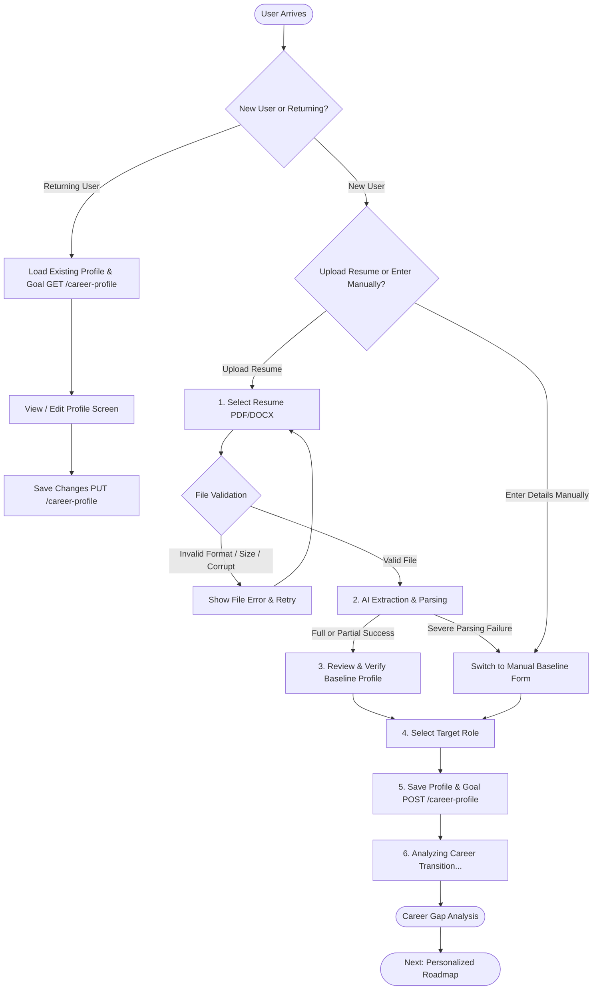

# Career Profile Onboarding

## Objective

Help a new user provide sufficient, accurate information about their current career baseline and their target career direction so that Career Switch Assistant can generate an actionable, evidence-based skill gap analysis and personalized roadmap.

## User

Software professional (typically 1–5 years of experience) seeking to transition from their current technical role to a target engineering role (e.g., Frontend → Full Stack, React → AI Engineer, Backend → Cloud).

## User Goal

I want to quickly tell Career Switch Assistant where I am in my career today and where I want to go next, without tedious manual form-filling.

## Product Goal

Capture the minimum viable information required to establish the user's baseline and career goal with minimal friction, setting the foundation for actionable career analysis.

---

## Conceptual Model & Architecture

To keep domain boundaries clean and scalable for the roadmap engine, the product explicitly separates **where the user is today** from **where the user wants to go**:

```text
User
 │
 ├── Career Profile (Where you are today)
 │      ├── Current Role
 │      ├── Years of Experience
 │      ├── Skill Sets
 │      └── Career Summary (optional)
 │
 └── Career Goal (Where you want to go)
        └── Target Role
```

These entities unite during post-onboarding processing to power the core value proposition:

$$\text{Career Profile} + \text{Career Goal} \xrightarrow{\text{AI Analysis}} \text{Career Gap Analysis} \xrightarrow{\text{Planning}} \text{Actionable Roadmap}$$

---

## Product Principles

- **The user remains in control of AI-generated profile information.** AI extractions and recommendations are strictly proposals; the user has final authority to edit, verify, or discard any attribute before saving.
- **AI proposes, user verifies, system saves:** AI never commits data directly to the database without explicit user confirmation.
- **Treat career guidance as advisory:** Onboarding data forms the basis for directional learning guidance rather than deterministic hiring guarantees.
- **Respect user privacy:** Resumes and profile records contain sensitive personal data; minimize payload sizes sent to AI providers, never sell or expose profile data, and use safe, verifiable messaging.
- **Graceful degradation:** If automated parsing encounters gaps or limitations, the system surfaces partial findings and prompts for the missing pieces instead of failing outright.
- **Equal dignity for manual entry:** Users who choose not to upload a resume must enjoy a fast, first-class onboarding experience, not a degraded fallback.

---

## Information Required

| Entity | Field | Purpose | Required? | Primary Source | Input Strategy |
| :--- | :--- | :--- | :--- | :--- | :--- |
| **Career Profile** | **Current Role** | Baseline professional position | Yes | Resume extraction | Free-text / verified chip |
| **Career Profile** | **Years of Experience** | Calibrates seniority & transition timeline | Yes | Resume extraction | Numeric input (decimal e.g. `3.4`) |
| **Career Profile** | **Skill Sets** | Inventory of current technical competencies | Yes | Resume extraction | Candidate chips (add/remove) |
| **Career Profile** | **Career Summary** | Qualitative background, domain nuances | Optional | Resume extraction | Textarea |
| **Career Goal** | **Target Role** | Destination for gap analysis & roadmap | Yes | User selection | Searchable suggestions + custom role |

---

## User Flow

The onboarding experience defaults to a **resume-first path** to eliminate manual data entry, while offering direct manual entry as a prominent, first-class alternative for users without a resume. Returning users with saved profiles bypass onboarding directly into profile management.



---

## Primary Onboarding Path

1. **Upload Resume:** User drops or selects their existing resume file (`.pdf`, `.docx`).
2. **File Validation:** Instant client-side and server-side checks verify format, size, and readability before invoking AI models.
3. **AI Extraction:** Background processing extracts candidate current role, estimated years of experience, technical skills, and optional summary.
4. **Review & Baseline Confirmation:** User inspects extracted profile data on an interactive screen, correcting any inaccuracies and verifying skills.
5. **Set Career Goal:** User chooses their target technical role using searchable suggestions or custom entry.
6. **Save & Next Stage:** User saves their confirmed profile and goal, triggering the next stage of career analysis.

---

## Direct Manual Entry Path

- Readily accessible from the initial entry screen via: *"Enter details manually"* or *"I don't have a resume"*.
- Built as a clean, streamlined single-view form with sensible defaults to ensure low friction.
- Collects Current Role, Years of Experience, Key Skills, and Target Role.
- Automatically offered with friendly messaging if a resume upload fails or times out.

---

## Resume Extraction & Skills Lifecycle

### Extraction Scope
Extract only roadmap-relevant attributes: Current Role, Years of Experience, Technical Skills list, and Career Summary. Extracted AI outputs are treated as untrusted draft input and validated against data schemas prior to UI rendering.

### Skills Maturation Lifecycle
To avoid premature taxonomy complexity while preventing profile pollution, skills follow a three-stage maturation model:

```text
Extracted Skills (raw text from AI extraction)
       ↓
Candidate Skills (editable UI chips shown during review)
       ↓
User-Verified Skills (persisted to profile upon confirmation)
```

- In V1, users quickly add or delete chips during the review stage.
- Canonical skill normalization will be handled by a downstream skill intelligence pipeline rather than burdening the user with manual taxonomy curation during onboarding.

### Graceful Degradation (Partial Extraction)
If the AI extraction extracts some attributes with high confidence but struggles with others, the system does **not** fail the upload. Instead, it populates what it found and presents an inline notice:

> *"We found most of your information. ⚠️ We couldn't confidently determine your years of experience. Please verify or enter it below."*

---

## Review & Correction

- **Interactive Verification:** All extracted values appear as editable form fields and dismissible chips (`[React ✕]`).
- **Clear AI Provenance:** A badge or banner visibly states: *"✨ Extracted from your resume with AI — please verify for accuracy."*
- **Validation Gates:** The user cannot proceed until required attributes (Current Role, Years of Experience, at least one Skill, and Target Role) are valid.

---

## Target Role Strategy (V1)

To deliver structured data for downstream skill gap models without artificially restricting user ambition, V1 implements **searchable suggestions with custom input fallback**:

- **Predictive Search:** As the user types (e.g., `Full Stack...`), prominent matches appear (`Full Stack Engineer`, `Full Stack Developer`, `Backend Engineer`).
- **Custom Input Escape Hatch:** If the user's desired transition is unique (e.g., `Embedded Rust Engineer` or `Web3 Security Auditor`), they can select *"Can't find yours? Enter custom role"*.
- Avoids building an expansive occupation taxonomy in V1 while standardizing 80%+ of common transitions.

---

## Trust & AI Transparency

- **AI Proposes, User Verifies, System Saves:** Under no circumstances is resume-parsed data written to PostgreSQL without explicit user confirmation.
- **Safe Privacy Copy:** UI copy maintains accurate, currently verifiable promises:
  > *"Your resume is used to build your career profile."*
  *(Stronger statements regarding permanent deletion or cryptographic guarantees will be added once private cloud storage and retention pipelines are finalized.)*

---

## UI States & Edge Cases

### 1. Initial State (Upload or Manual)
- Resume dropzone supporting `.pdf` and `.docx` up to 5 MB.
- Prominent alternative button: *"Enter details manually"*.

### 2. File Validation Error
- Surfaces immediately if the file violates constraints:
  - **Unsupported format:** File is not `.pdf` or `.docx`.
  - **File too large:** File exceeds 5 MB.
  - **Corrupted / Empty:** File contains no readable text.
  - **Password-protected PDF:** File is locked with encryption.

### 3. Extraction in Progress
- Engaging indeterminate progress state: *"Analyzing your experience and skills..."*.
- Displays an accessible link: *"Taking too long? Enter details manually"*.

### 4. Review & Edit (Baseline Profile)
- Populated with candidate values.
- If partial extraction occurred, ambiguous fields are highlighted with helpful prompts.

### 5. Goal Setting (Target Role)
- Searchable suggestions combobox with custom role creation option.

### 6. Saving & Transition
- Save button enters loading state to prevent double submits while persisting data via `POST /career-profile`.

### 7. Post-Save Transition State
- Displays an indeterminate progress state: *"Analyzing your career transition..."*. Accommodates standard LLM extraction and career analysis latencies (e.g., 5–15 seconds) smoothly without freezing the UI.

### 8. Existing Profile (Returning User)
- When a returning user already has a saved Career Profile and Career Goal, the application loads the existing information (`GET /career-profile`) and displays it in a clean profile view, allowing the user to review or update their baseline and target goal (`PUT /career-profile`).
- **Notification Rule:** Do **not** show an intrusive toast notification simply because the profile loaded normally.

---

## Wireframes

### Screen 1: Resume Upload (Initial Entry)

```text
┌─────────────────────────────────────────────────────────────┐
│  Career Switch Assistant                       ● ───── ○    │
├─────────────────────────────────────────────────────────────┤
│                                                             │
│  Build your career baseline                                 │
│  Upload your resume to automatically extract your skills,   │
│  experience, and current role.                              │
│                                                             │
│  ┌───────────────────────────────────────────────────────┐  │
│  │                                                       │  │
│  │      📄 Drop your resume here, or browse files        │  │
│  │      Supports PDF or DOCX (Max 5 MB)                  │  │
│  │                                                       │  │
│  └───────────────────────────────────────────────────────┘  │
│                                                             │
│  🔒 Your resume is used to build your career profile.       │
│                                                             │
│  ─────────────────────── or ───────────────────────         │
│                                                             │
│             [ Enter details manually → ]                    │
│                                                             │
└─────────────────────────────────────────────────────────────┘
```

### Screen 1A: File Validation Rejection Modal / Alert

```text
┌─────────────────────────────────────────────────────────────┐
│  ⚠️ Resume couldn't be uploaded                             │
├─────────────────────────────────────────────────────────────┤
│                                                             │
│  The file "my_resume.pdf" is larger than 5 MB.              │
│  Please choose a smaller file or continue with manual entry.│
│                                                             │
│  [ Choose another file ]       [ Enter details manually ]   │
│                                                             │
└─────────────────────────────────────────────────────────────┘
```

### Screen 2: Review Baseline Profile (Where You Are Today)

```text
┌─────────────────────────────────────────────────────────────┐
│  Career Switch Assistant                       ● ───── ○    │
├─────────────────────────────────────────────────────────────┤
│                                                             │
│  Step 1: Verify your career baseline                        │
│  ✨ Extracted from your resume with AI — please verify.     │
│                                                             │
│  Current Role *                                             │
│  ┌───────────────────────────────────────────────────────┐  │
│  │ Frontend Developer                                    │  │
│  └───────────────────────────────────────────────────────┘  │
│                                                             │
│  Years of Experience *                                      │
│  ┌───────────────────────────────────────────────────────┐  │
│  │ 3.4                                                   │  │
│  └───────────────────────────────────────────────────────┘  │
│                                                             │
│  Identified Skills *                                        │
│  ┌───────────────────────────────────────────────────────┐  │
│  │ [React ✕] [TypeScript ✕] [Next.js ✕] [+ Add Skill]   │  │
│  └───────────────────────────────────────────────────────┘  │
│                                                             │
│  Career Summary (Optional)                                  │
│  ┌───────────────────────────────────────────────────────┐  │
│  │ Frontend specialist focusing on modern React apps.    │  │
│  └───────────────────────────────────────────────────────┘  │
│                                                             │
│  [ Re-upload resume ]                   [ Continue to Goal → ]
│                                                             │
└─────────────────────────────────────────────────────────────┘
```

### Screen 3: Set Career Goal (Where You Want To Go)

```text
┌─────────────────────────────────────────────────────────────┐
│  Career Switch Assistant                       ○ ───── ●    │
├─────────────────────────────────────────────────────────────┤
│                                                             │
│  Step 2: Set your career goal                               │
│  Where do you want to transition next?                      │
│                                                             │
│  Target Role *                                              │
│  ┌───────────────────────────────────────────────────────┐  │
│  │ Full Stack...                                         │  │
│  └───────────────────────────────────────────────────────┘  │
│    Suggested:                                               │
│    • Full Stack Engineer                                    │
│    • Full Stack Developer                                   │
│    • Backend Engineer                                       │
│                                                             │
│    Can't find yours? [ Enter custom role: ____________ ]    │
│                                                             │
│                                                             │
│  [ ← Back to Baseline ]                 [ Save Profile & Goal → ]
│                                                             │
└─────────────────────────────────────────────────────────────┘
```

### Screen 4: Direct Manual Entry Form

```text
┌─────────────────────────────────────────────────────────────┐
│  Career Switch Assistant — Manual Setup                     │
├─────────────────────────────────────────────────────────────┤
│                                                             │
│  Build your career profile manually                         │
│                                                             │
│  Current Role *                                             │
│  ┌───────────────────────────────────────────────────────┐  │
│  │ e.g. Frontend Developer                               │  │
│  └───────────────────────────────────────────────────────┘  │
│                                                             │
│  Years of Experience *                                      │
│  ┌───────────────────────────────────────────────────────┐  │
│  │ e.g. 3.0                                              │  │
│  └───────────────────────────────────────────────────────┘  │
│                                                             │
│  Key Skills *                                               │
│  ┌───────────────────────────────────────────────────────┐  │
│  │ e.g. React, JavaScript, CSS (comma separated)         │  │
│  └───────────────────────────────────────────────────────┘  │
│                                                             │
│  [ ← Back to Upload ]                   [ Continue to Goal → ]
│                                                             │
└─────────────────────────────────────────────────────────────┘
```

### Screen 5: Existing Profile (Returning User View & Edit)

```text
┌─────────────────────────────────────────────────────────────┐
│  Career Switch Assistant                                    │
├─────────────────────────────────────────────────────────────┤
│                                                             │
│  Your Career Baseline & Goal                                │
│                                                             │
│  Current Role               Target Goal                     │
│  Frontend Developer         Full Stack Developer            │
│                                                             │
│  Years of Experience        Profile Summary                 │
│  3.4 years                  Frontend specialist...          │
│                                                             │
│  Active Skills                                              │
│  [React] [TypeScript] [Next.js]                             │
│                                                             │
│  ─────────────────────────────────────────────────────────  │
│                                                             │
│  [ Edit Profile ]                   [ View Career Roadmap → ]
│                                                             │
└─────────────────────────────────────────────────────────────┘
```

---

## Post-Save Experience & Career Analysis

Onboarding does not deposit the user on a blank dashboard. Immediately upon clicking **Save Profile & Goal**, the application orchestrates the transition into career analysis:

```text
Profile & Goal Saved
       ↓
"Analyzing your career transition..." (Indeterminate progress state)
       ↓
Career Gap Analysis
       ↓
Generate Roadmap
```

### Latency & UX Architecture
The analysis transition uses an indeterminate progress indicator. This design accommodates standard LLM extraction and career analysis latencies (e.g., 5–15 seconds) smoothly without freezing the interface, maintaining system responsiveness while leaving room to transition to an asynchronous worker job model if processing demands expand in later milestones.

---

## Open Technical & Architecture Decisions

- **Target-Role Skill Requirement Source:** Define where the canonical benchmark skills for target roles originate (e.g., curated role taxonomy, live job market data, or contextual AI evaluation) in a dedicated feature specification.
- **Resume File Retention Policy:** Once file storage infrastructure (e.g., S3/minio) is deployed, decide whether the raw resume document is retained in encrypted storage for future profile updates or securely wiped immediately following AI extraction.
- **Downstream Skill Normalization Pipeline:** Design the backend pipeline that maps diverse user-verified skill strings into canonical taxonomy records without interfering with the lightweight onboarding UI.
